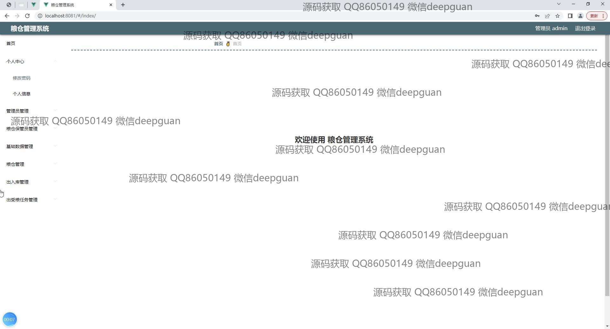
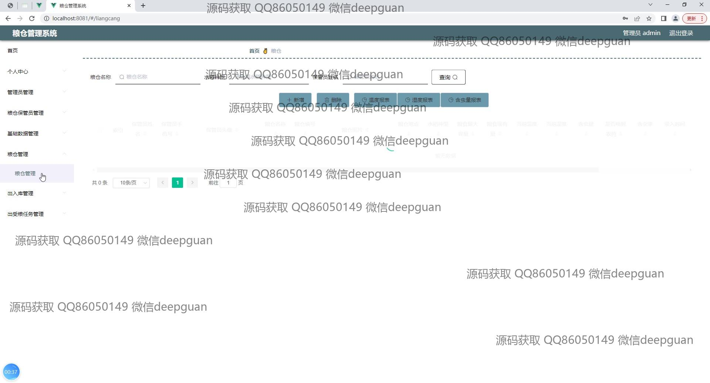
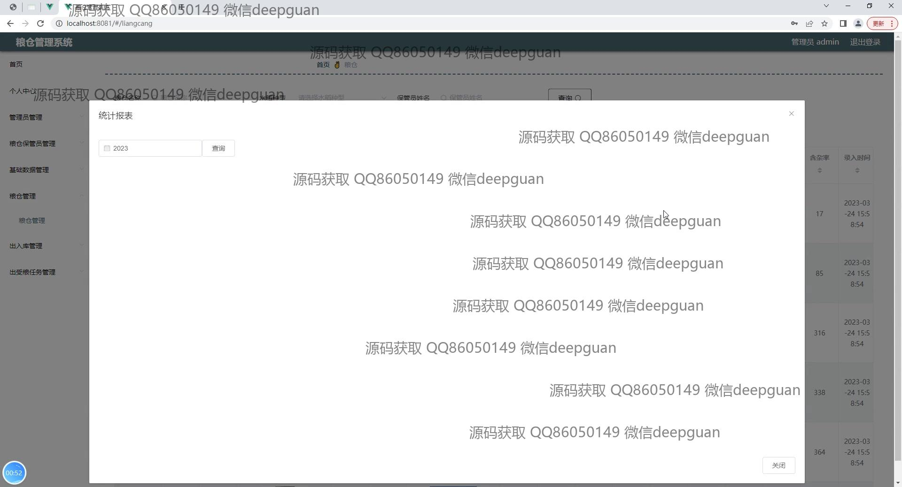
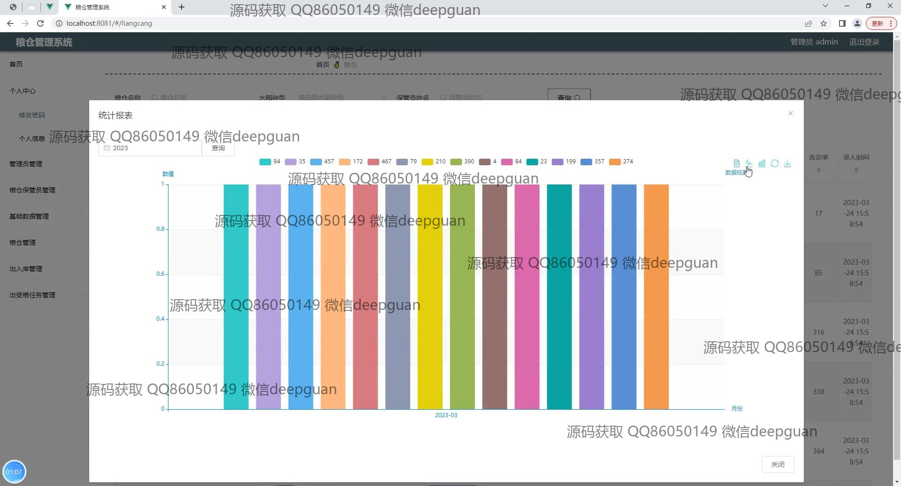
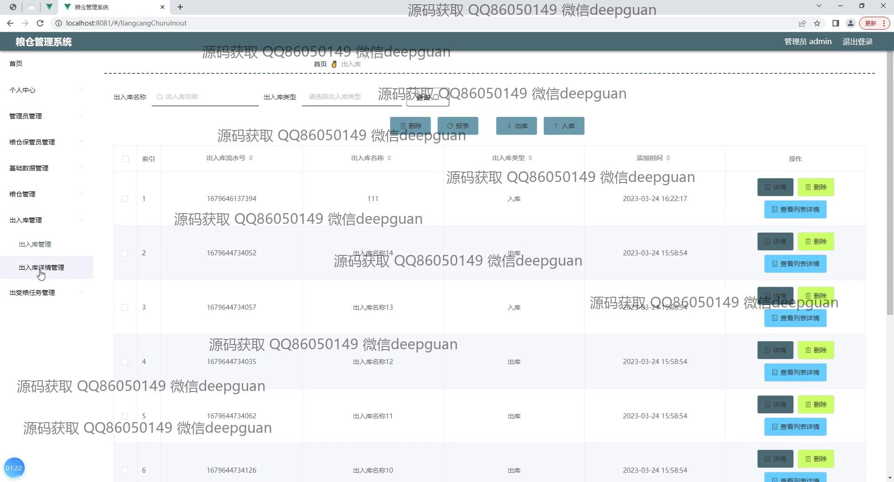
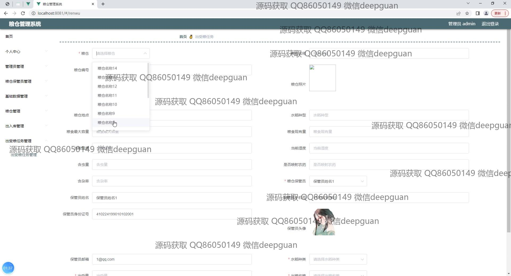
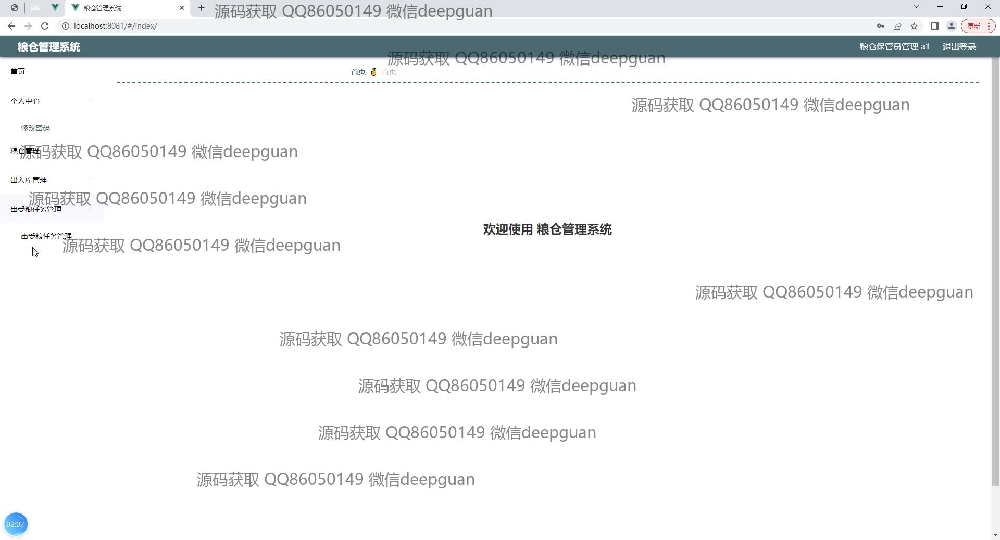
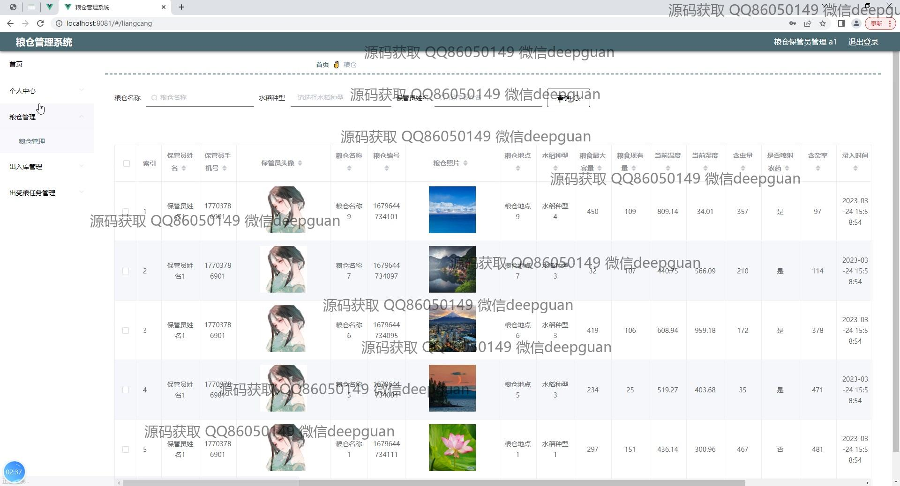

<h1 align="center">粮仓管理系统的设计与实现</h1>

## 简介
粮仓管理系统：角色分为管理员、用户；功能包括粮仓管理、出入库管理、粮食质量管理、统计报表生成、任务管理，操作简单、界面友好，支持数据查询与导出，提升粮仓管理效率和安全性。    --计算机毕业设计源码；毕设源码；java毕业设计源码

## 联系方式

<h3 align="center">获取完整代码与数据库文件 + 微信：deepguan QQ: 86050149 QQ群: 783742310</h3>

<h3 align="center">可帮忙远程部署 包运行成功！提供远程部署、修改代码、设计文档指导、代码讲解等服务！</h3>

## 功能介绍（完整见运行截图）
管理员：管理员在粮仓管理系统中可以访问和操作多个功能模块，包括个人中心管理、粮仓和出入库管理、统计报表生成、用户权限管理等。他们能够通过系统访问粮仓的详细信息，管理库存，执行出入库任务，并生成统计报表以优化粮仓的日常运作。管理员还负责设置和调整用户权限，确保数据安全及系统的有效运行。

仓库管理员：仓库管理员的主要职责是在粮仓系统中执行实际的仓储操作。通过出入库管理模块，查看和更新粮仓的库存信息，执行具体的出入库任务。仓库管理员可以输入粮仓的基本信息、管理储存条件如温度和湿度、并负责记录粮食品种和虫害信息。此外，还需运营各类任务如出库任务，并能够在界面中导入相关文档与图片进行记录。

用户：普通用户在粮仓管理系统中能够访问相关的个人和仓库信息，通过简单直观的导航界面查看库存情况、及时了解粮仓的容量与物资流动状态。用户可以通过报表查询功能查看粮仓存储数据，并且参与到对应的数据统计和决策过程中。他们的权限可能受限于查看汇总信息，而不涉及到实际的出入库操作和权限管理。

系统管理员：系统管理员负责维护整个粮仓管理系统的正常运作，包括系统升级与备份、用户账号管理、以及安全设置和报警管理。通过后台功能，系统管理员确保用户信息和操作日志记录的安全与保密。同时，系统管理员提供必要的技术支持和用户培训，以确保用户准确地使用系统的各项功能，促进系统操作的流畅性和可靠性。

## 运行截图

本代码来源于网络,仅供学习参考使用!

